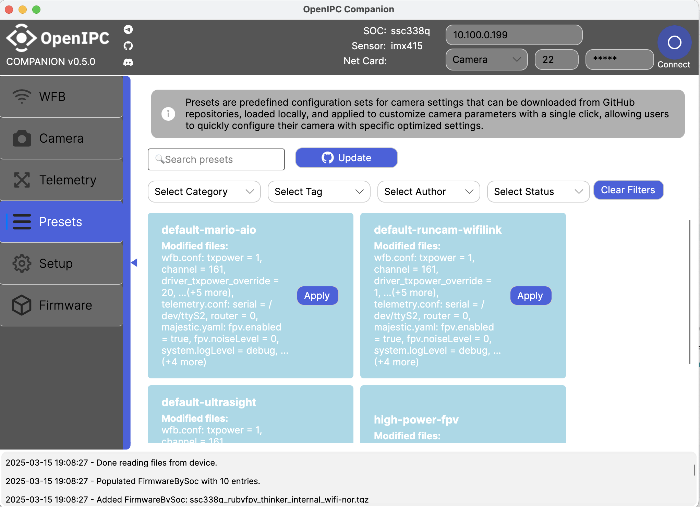
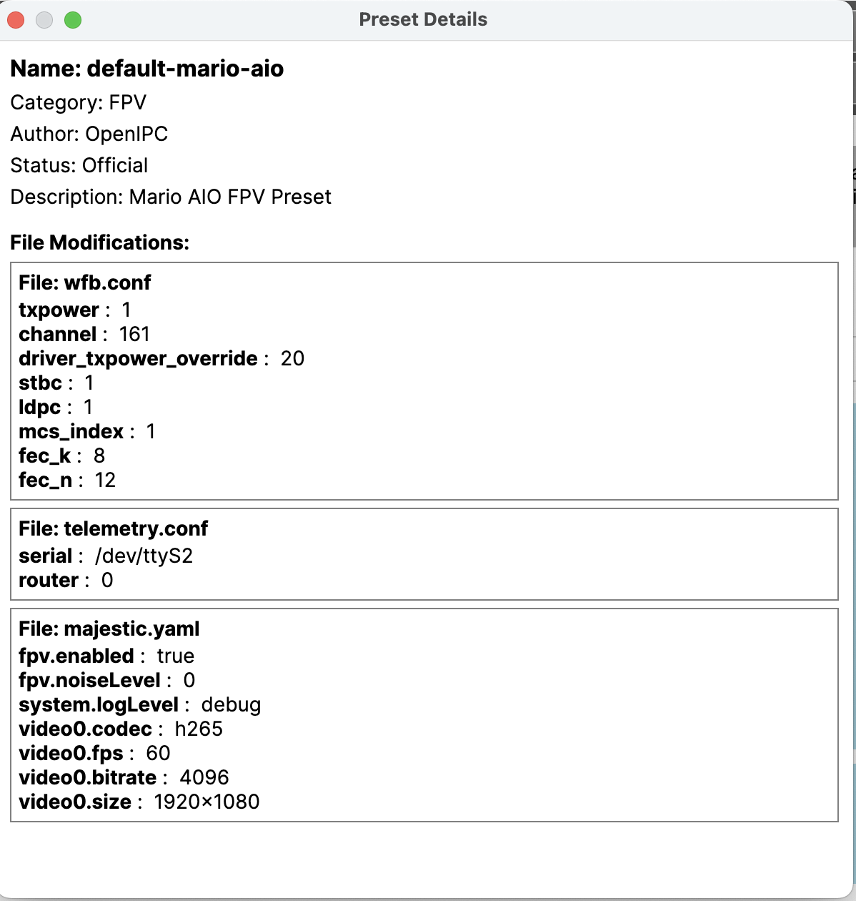

## Presets for configuring OpenIPC FPV systems

# OpenIPC FPV Presets

Collection of preconfigured presets for OpenIPC FPV Configurator application.

## How to Add a Preset

Adding a new preset to this repository is straightforward. Follow these steps to contribute your FPV camera configuration:

### 1. Fork the Repository

1. Click the "Fork" button at the top right of this repository
2. Clone your forked repository to your local machine:
   ```bash
   git clone https://github.com/YOUR-USERNAME/fpv-presets.git
   cd fpv-presets
   ```

### 2. Create a New Preset

#### Option A: Use the Helper Script

1. Run the provided creation script which will guide you through the process:
   ```bash
   ./create_preset.sh
   ```
   This interactive script will:
   - Ask for your preset details
   - Create the necessary folder structure
   - Generate a template `preset-config.yaml` file

#### Option B: Manual Creation

1. Create a new folder inside the `presets` directory. Use a descriptive name for your preset:
   ```bash
   mkdir -p presets/my-awesome-preset
   ```

2. Inside your preset folder, create a `preset-config.yaml` file with the following structure:
   ```yaml
   name: "My Awesome Preset"
   category: "Race" # Options: Race, Freestyle, Cinematic, Indoor, LongRange, etc.
   author: "Your Name"
   description: "A detailed description of what this preset is optimized for"
   status: "Official" # Options: Draft, Testing, Stable, Official (used by OpenIPC devs)
   tags:
     - mario
     - aio
     - daylight
     - lowlatency
   
   # Camera configuration settings
   files:
     majestic.yaml:
       nightMode: false
       bitrate: 4
       wdr: false
       # Add all your camera configuration parameters here

    # the files will be copied to etc, the must exist in your preset folder (there are protections against system files)
    additional_files:
      - vtxmenu.ini
   ```

2. Make sure to include all relevant parameters for your preset in the `files` section

### 4. Test Your Preset

1. Test your preset with the OpenIPC FPV Configurator to ensure it works as expected
2. Verify that your `preset-config.yaml` file is properly formatted and contains all necessary settings

### 5. Submit a Pull Request

1. Commit your changes:
   ```bash
   git add presets/my-awesome-preset/
   git commit -m "Add My Awesome Preset for XYZ camera"
   git push origin main
   ```

2. Go to the original repository and click "Pull Request"
3. Fill out the PR template with details about your preset

### Notes

- The `PRESET_INDEX.yaml` file is automatically generated - don't modify it manually
- Each preset must include a complete `preset-config.yaml` file
- Make sure your preset has a unique and descriptive name
- Include as much detail as possible in the description to help users understand when to use your preset

## Screenshots



## Preset Layout

### 1. Folder Structure

Each preset is a self-contained folder under the `presets/` directory. It includes:

- **`preset-config.yaml`**: Defines preset metadata, attributes, and modified files.
- **YAML configuration files** (e.g., `wfb.yaml`, `majestic.yaml`).
- **Optional `sensor/` folder**: Includes binary files like `milos-sensor.bin`.

**Example Structure**:
```
presets/
├── high_power_fpv/
│   ├── preset-config.yaml
│   ├── vtxmenu.ini
```

---

### 2. Preset Definition (`preset-config.yaml`)

The `preset-config.yaml` file defines:

- **Metadata**: `name`, `author`, `description`, and `category`.
- **Optional Sensor**: Specifies a binary file (e.g., `milos-sensor.bin`) to be transferred to the remote device.
- **Files**: Specifies files and their key-value modifications.

**Example**:
```yaml
name: "High Power FPV"
author: "OpenIPC"
description: "Optimized settings for high-power FPV."
sensor: "milos-sensor.bin"
files:
  wfb.yaml:
    wireless.txpower: "30"
    wireless.channel: "161"
  majestic.yaml:
    fpv.enabled: "true"
    system.logLevel: "info"
```

---

### 3. Preset Loading

- The application scans the `presets/` directory.
- It parses each `preset-config.yaml` to create a `Preset` object.
- File modifications are transformed into a bindable `ObservableCollection<FileModification>` for the UI.

---

### 4. Applying Presets

What hppens when a preset is applied:

1. **Sensor File Transfer**:
    - If a sensor is specified, it is transferred using **SCP**:
      ```bash
      scp presets/high_power_fpv/sensor/milos-sensor.bin user@remote:/etc/sensors/milos-sensor.bin
      ```

2. **File Modifications**:
    - Each attribute in `files` is applied using **`yaml-cli`**:
      ```bash
      yaml-cli -i /etc/wfb.yaml "wireless.txpower" "30"
      yaml-cli -i /etc/wfb.yaml "wireless.channel" "161"
      yaml-cli -i /etc/majestic.yaml "fpv.enabled" "true"
      yaml-cli -i /etc/majestic.yaml "system.logLevel" "info"
      ```

3. **Logs**:
    - Logs success or failure of sensor transfer and YAML modifications.

---

### 5. UI Workflow

- **Preset List**:
    - Displays all available presets using a `ListBox`.
    - Users can select a preset by its name.

- **Details Panel**:
    - Displays metadata (`Name`, `Author`, `Description`).
    - Lists file modifications and sensor file.

- **"Apply Preset" Button**:
    - Applies the selected preset’s changes to the remote device.
    - Button is enabled only if a preset is selected.

---

### Key Features

- **Dynamic Preset Management**:
    - Add/remove presets by simply editing the `presets/` directory.
- **File Abstraction**:
    - Presets only define attributes; the app handles file locations.
- **Sensor File Handling**:
    - Automatically transfers sensor binaries if specified.
- **User-Friendly UI**:
    - Select a preset, view details, and apply it with a single click.

### TODO
* Add capability for users to add their own repo's
* Save current settings to a file